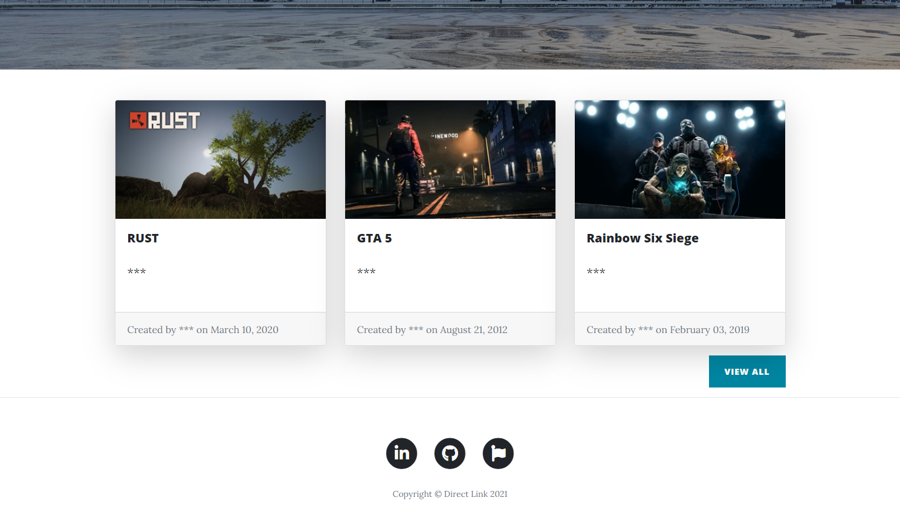
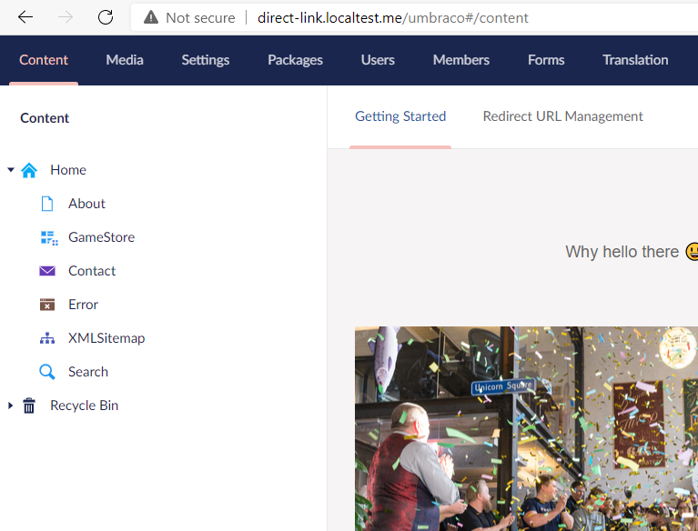

# Direct-Link

This is an Asp.net framework 4.7.2 with Umbraco.
I created a new site with Umbraco, and everyone seems to be talking about WordPress, a blogging platform, which makes me think this is the best option.
This project helps to find gaming system requirements, ( A blogging platform).[Example](https://gamesystemrequirements.com/).

#### Home Page


#### Umbraco Home Page


#### Screenshots
[Screenshots](https://github.com/SubhiNajjar/Direct-Link/tree/master/Screenshots)


## Backend
* Microsoft ASP.NET 4.7.2 MVC
* **Database** : Microsoft SQL Express 2017, [Download](https://www.microsoft.com/en-us/download/details.aspx?id=55994).
* SMTP

## Frontend 
* UmbracoCms **Version**: 8.11.1.
* JS
* Clean blog template [Download](https://startbootstrap.com/theme/clean-blog).
* jQuery
* Ajax

## Microsoft IIS
* IIS builder [GitHub](https://github.com/mattou07/iis-builder).


## Set-up Commands

``` bash
update-package Microsoft.CodeDom.Providers.DotNetCompilerPlatform -r
```

## Umbraco admin
``` bash
http://localhost:****/umbraco

After Powershell
direct-link.localtest.me/umbraco
```

## Set-up IIS
``` bash
# Powershell administrador
IIS-Builder.ps1
```

